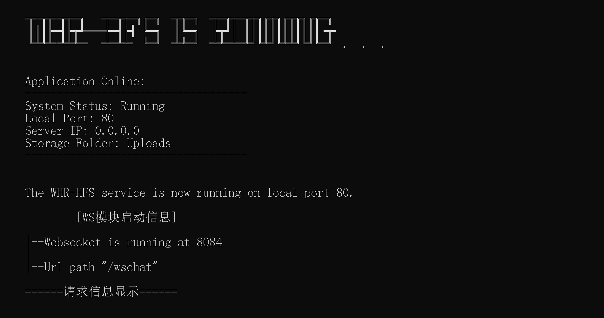

# WHR-HFS Server

## Introduction
WHR-HFS is a server application that provides file upload, download, and streaming services.
## 介绍
WHR-HFS是一个提供文件上传、下载和流媒体服务的服务器应用程序。

## Installation
To install and run the WHR-HFS server, follow these steps:
1. Clone the repository
2. Cd it and install the necessary node modules using `npm install`
3. Run the server using `node app.js`
## 安装
要安装和运行WHR-HFS服务器，请按照以下步骤操作：
1. 克隆存储库
2. 使用`npm install`安装必要的节点模块
3. 使用`node app.js`命令行来运行服务器
## Features
- File Upload and Download
- Websocket Chat Server
- Notification and Permissions
- More...
## 特性
- 文件上传与下载
- 基于Websocket的聊天服务
- 通知和权限
- 更多

## Usage
Once the server is running, you can access the functionality using the following endpoints:

- File Upload: `/WHR-HFS-API/Upload` [POST]
- File List: `/WHR-HFS-API/Files-list` [GET]
- File Download: `/WHR-HFS-API/Download/{filename}` [GET]
## Web UI

## Chat room UI

## Contributors(贡献者)
##### WHRSTUDIO
##### WZH-Team
## License
This project is licensed under the MIT License - see the LICENSE file for details.
